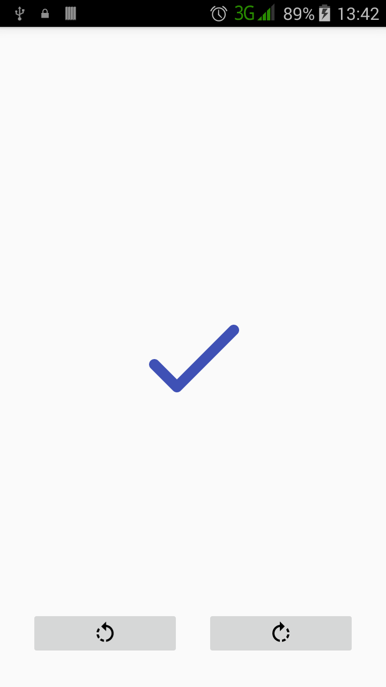
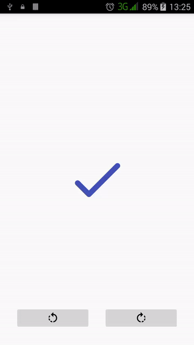

# hearty

Ticking :heavy_multiplication_x: and crossing :heavy_check_mark: Android. 

## Introduction :point_up:

Here we have an Android app that shows the way Android [vectors] can be used to change shapes. Not many shapes though - this one only changes an X to a tick and vice versa on the click of a button. The underlying work done by the framework was covered in [Udacity's](https://www.udacity.com/) online Android class called [Material Design for Android Developers](https://www.udacity.com/course/material-design-for-android-developers--ud862). This repo slightly changes Udacity's original source code found in [their class GitHub page](https://github.com/udacity/ud862-samples) inside the [TickCross](https://github.com/udacity/ud862-samples/tree/master/TickCross) folder.

## Version History :package:

**latest** 	[Tickross v1.0.0] 	Monday, July 25, 2016

This repo tries its best to follow the [Semantic Versioning](http://semver.org/) guidelines.

## How To Use :wrench:

:zero: Install the app.

:one: Opening the app you will find a blue check mark (or blue tick(not the insect tick)) in the middle of the screen as well as two buttons at the bottom of the screen, the left one with a rotate left icon and the right one with a rotate right icon. In less words:

 

:two: Tapping on the rotate left icon converts the tick to a cross while rotating it left, and reversing the conversion when tapped again. As a side-effect, the new tick is facing down. We'll explain this in a bit. The whole process looks like this:

 

:three: Tapping on the rotate right icon converts the tick to a cross while rotating it right. It reverses the conversion when tapped again. 

 

If you are a bit careful you might notice that when changing the tick to the cross, the rotate right starts with the tick facing up side down too. We'll get to this too. 

:four: Have fun with the buttons. Try to find out which combination of buttons provides a smooth, believable transition from tick to cross and from cross to tick. :sunglasses:

A hint can be found [here](screen-records/tickross-main-activity-rotate-left-rotate-right-2016-07-25-125715.gif). :wink:

## How It Works

To achieve these transitions, we use Android [vector] [path morphing]. That allows us to change - or morph - the path of the vector forming the tick to look like and thus be the cross. The reverse is also true: we change the path of the cross to look like and thus be the tick.

For path morphing to work, the path we are morphing from and the path we are morphing to must be compatible. One of the ways paths are compatible are when they have the same number of points. A tick is formed by two lines - thus four points; and a cross is also formed by two lines - four points too. As such the tick and the cross are compatible. So we can morph them. :smile: This is a simple explanation, though. I feel there is still much I do not know about vectors in general and path morphing specifically.

We have our morphable paths. But just changing them from one to another looks rather bland, as you can see here :point_down:.

 

So we add some rotation to make things look interesting. The results of the rotation are what we see in the video clips in the **How To Use** section.

The icons in the buttons are also vectors. We rotate them about their center every time their host buttons are clicked.

## Abilities :muscle:

This app demonstrates:

* Path morphing.
* Vector animation.

## Limitations :worried:

This app can only do those two things in the abilities section. :grin:

## Possible Future Work :fast_forward:

As of Monday, July 25, 2016, future work might be: 
- [ ] Implement path morphing in the buttons in the [hearty] repo.
- [ ] Attempt changing the rotation to a flip. (Tried this by substituting `android:propertyName="rotation"` with `android:propertyName="rotationY"` in the [res/rotate_right.xml] file but it did not work first time)
- [ ] Put a reset button to return the animation to its initial position.
- [ ] Attempt changing the rotation to a scale.

## Other things :books:

Thumbs up :+1: to:
* Udacity for the class. Very nice. 
* Jake Wharton for [Butter Knife](http://jakewharton.github.io/butterknife/), a library for binding fields to views in Android. This was used to bind the buttons and the tick cross image view.

Path morphing does not work in pre-Lollipop devices, as one can find out [here]. How did we make it to have videos this time with my pre-Lollipop problem? I'd like to say hats off :tophat: to @wnafee for his library [vector-compat] which allows vector use for older versions of Android. Was hard to start using (mostly because I made assumptions and did not read documentation :grin:) but has been very helpful. Thanks a lot.

## License :lock_with_ink_pen:

This repository is licensed under the [GNU General Public License Version 3](http://www.gnu.org/licenses/gpl-3.0.en.html).
